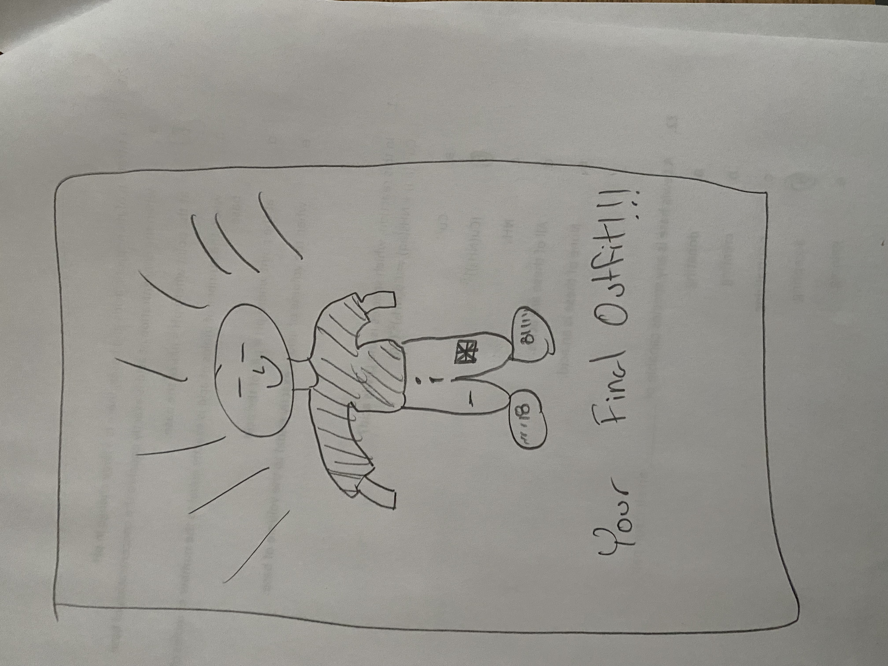
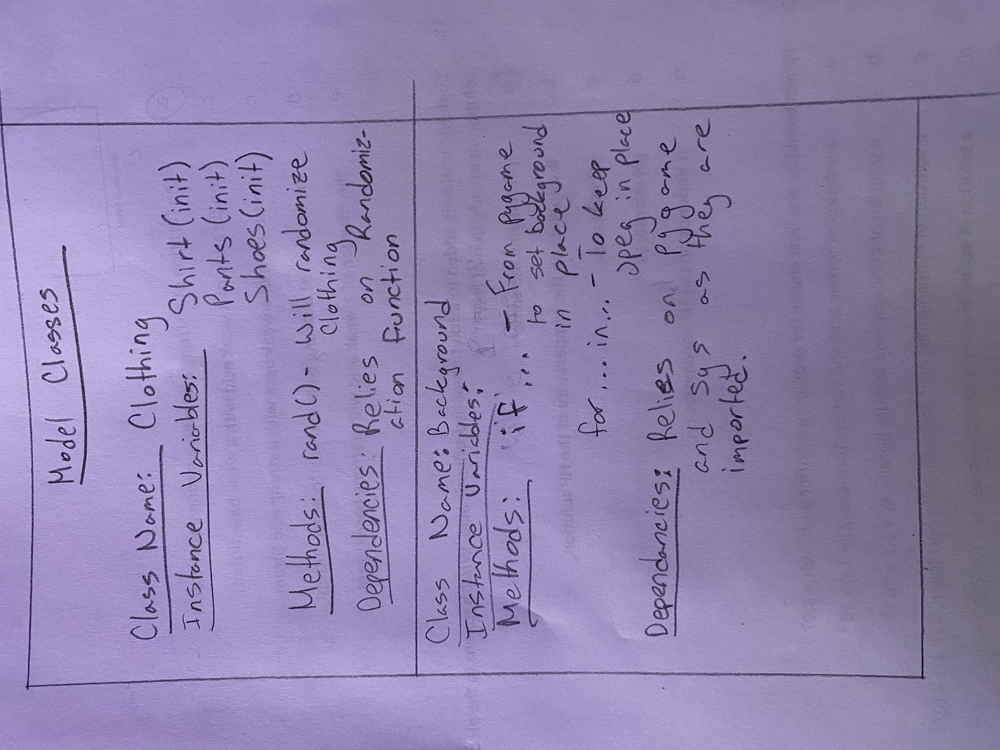

:warning: Everything between << >> needs to be replaced (remove << >> after replacing)
# CS110 Project Proposal
# Random Outfit Generator 
## CS 110 Final Project
### 2022
### Ever been indecisive and didn't know what outfit you wanted to wear for the day? This is the perfect project for you then. You import your clothing and then you can either randomize the speific clothing on whatever part of your body you desire of if you realy don't know what you want to wear you can randomize everything. 

<< [repl](#) >>

<< [link to demo presentation slides](#) >>

### Team: Python Gang
#### Team Members
Christopher Micu, Michelle Kang, Alexander Rodriguez

***

## Project Description *(Software Lead)*

In our final project we wanted to allow users to be able to choose their outfit for the day randomly. A lot of times you wake up and simply do not know what to get dressed into, our game would allow a user to physically see and interact with different types of clothing on their own body.

***    

## User Interface Design *(Front End Specialist)*
Start Menu:

Game Screen:

Game Over:

* << A wireframe or drawing of the user interface concept along with a short description of the interface. You should have one for each screen in your program. >>
    * For example, if your program has a start screen, game screen, and game over screen, you should include a wireframe / screenshot / drawing of each one and a short description of the components
* << You should also have a screenshot of each screen for your final GUI >>

***        

## Program Design *(Backend Specialist)*

* Non-Standard libraries
  * pygame
  * sys
    * << You should have a list of any additional libraries or modules used (pygame, request) beyond non-standard python. >>
    * For each additional module you should include
        * url for the module documentation
        * a short description of the module
* Class Interface Design
    * << A simple drawing that shows the class relationships in your code (see below for an example). >>
    * 
        * 
    * This does not need to be overly detailed, but should show how your code fits into the Model/View/Controller paradigm.
* Classes
    * << You should have a list of each of your classes with a description. >>

## Project Structure *(Software Lead)*

The Project is broken down into the following file structure:

* main.py
* src
    * <all of your python files should go here>
* assets
    * <all of your media, i.e. images, font files, etc, should go here)
* etc
    * <This is a catch all folder for things that are not part of your project, but you want to keep with your project. Your demo video should go here.>

***

## Tasks and Responsibilities *(Software Lead)*

   Alex will be the main leader of the code, he will be working on coding most of the components such as the background and the change of clothes as inputted by the user
   Michelle will be finding external clothing, backgrounds, and code information for Alex. She will be also helping with code and whatever errors are encountered
   Christopher will help out with coding as well as completing most of the presentation and script. He will be coding the background hand in hand with Alex. The ideas and little details in the project will come from him and any errors found will be researched by him.

### Software Lead - Michelle

Worked as integration specialist by taking all the code from the Back End Specialist and bringing it all together into this repl and making sure the entire thing works in unison.

### Front End Specialist - Christopher Micu

Front-end lead conducted significant research on finding different pieces of clothing and finding the background. Basically everything that needed to be found in an external source was found by him.

### Back End Specialist - Alex

The back end specialist will write most of the driver code and make sure each little part works, in order for the software lead to be able to bring it all together and make sure it all works as one

## Testing *(Michelle)*

We are simply going to run the code and see if it performs what we would like it to perform which is generate random clothes as well as being able to change each individual piece if needed.

## ATP

| Step                  | Procedure     | Expected Results  | Actual Results |
| ----------------------|:-------------:| -----------------:| -------------- |
|  1  | Run Counter Program  | GUI window appears with count = 0  |          |
|  2  | click count button  | display changes to count = 1 |                 |
etc...
